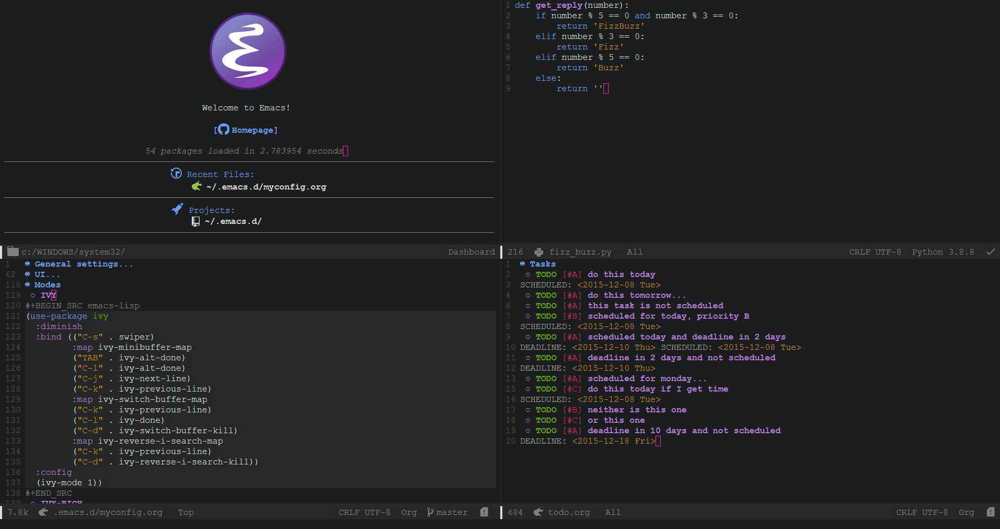

<p align="center"></p>
<p align="center"><a href="https://www.gnu.org/software/emacs/"><b>GNU Emacs</b></a></p>
<p align="center">
	<a href="https://www.gnu.org/software/emacs/"></a>
	<a href="https://orgmode.org/"></a>
	<a href="https://github.com/jwiegley/use-package"></a>
</p>
<p align="center">This repository contains all my GNU Emacs configuration.</p>

---

<p align="center"></p>

<blockquote>
    Mode Line: <a href="https://github.com/seagle0128/doom-modeline">DOOM Modeline</a> <br>
	Theme:<br>
    &nbsp;&nbsp;&nbsp;&nbsp;Dark theme: <a href="https://github.com/hlissner/emacs-doom-themes/blob/screenshots/doom-Iosvkem.png">doom-Iosvkem</a><br>
    &nbsp;&nbsp;&nbsp;&nbsp;Light theme: <a href="https://github.com/hlissner/emacs-doom-themes/blob/screenshots/doom-opera-light.png">doom-opera-light</a>
</blockquote>

List of files:

- [`myconfig.org`](https://github.com/EgorTolbaev/.emacs.d/blob/master/myconfig.org):
  main configuration file.

- [`init.el`](https://github.com/EgorTolbaev/.emacs.d/blob/master/init.el):
  load the generated configuration file.

## Getting Started

You can test my complete configuration with:

```
git clone https://github.com/EgorTolbaev/.emacs.d.git
```
