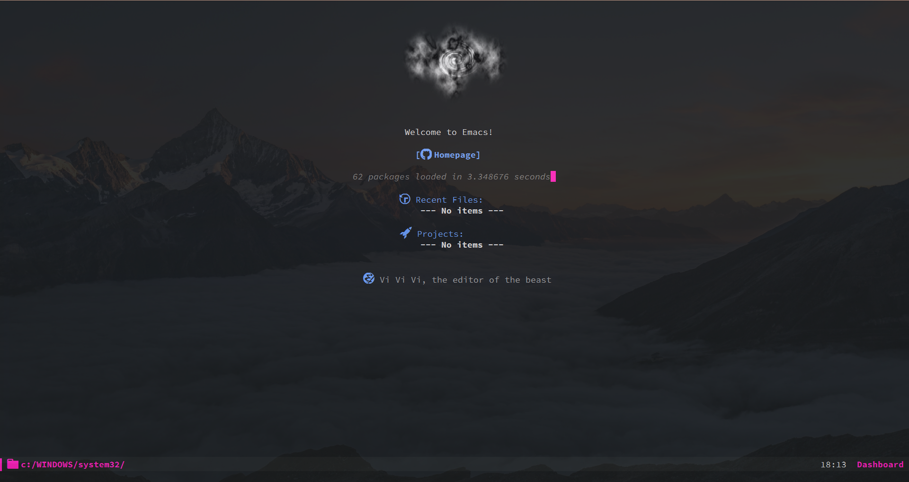

<p align="center"></p>
<p align="center"><a href="https://www.gnu.org/software/emacs/"><b>GNU Emacs</b></a></p>
<p align="center">
	<a href="https://www.gnu.org/software/emacs/"></a>
	<a href="https://orgmode.org/"></a>
	<a href="https://github.com/jwiegley/use-package"></a>
</p>
<p align="center">Этот репозиторий содержит мою конфигурацию GNU Emacs.</p>
<p align="center">Read this in other languages: <a href="README.en.md">English</a></p>

---

<p align="center"></p>

<details>
  <summary>Скриншоты</summary>
  Dashboard
  <p align="center"></p>
  Org-mode
  <p align="center"></p>
  Dired
  <p align="center"></p>
  Treemacs
  <p align="center"></p>
</details>

<br/>

<blockquote>
	GNU Emacs: 29.1<br>
    Mode Line: <a href="https://github.com/seagle0128/doom-modeline">DOOM Modeline</a><br>
	Тема:<br>
    &nbsp;&nbsp;&nbsp;&nbsp;Темная тема: <a href="https://github.com/hlissner/emacs-doom-themes/blob/screenshots/doom-Iosvkem.png">doom-Iosvkem</a><br>
    &nbsp;&nbsp;&nbsp;&nbsp;Светлая тема: <a href="https://github.com/hlissner/emacs-doom-themes/blob/screenshots/doom-opera-light.png">doom-opera-light</a>
    <br>
    Font: <a href="https://fonts.google.com/specimen/Fira+Mono">Fira Mono</a>
</blockquote>

<br/>

Список файлов:

- [`myconfig.org`](https://github.com/EgorTolbaev/.emacs.d/blob/master/myconfig.org):
  основной файл конфигурации.

- [`init.el`](https://github.com/EgorTolbaev/.emacs.d/blob/master/init.el):
  сгенерированный файл конфигурации.

## Инструкции по использованию

### GNU/Linux и macOS

В GNU/Linux GNU Emacs можно найти в менеджере пакетов каждого основного дистрибутива GNU/Linux. В macOS Вы можете установить GNU Emacs с помощью Homebrew через brew install GNU Emacs.

Вы можете легко начать работу с этой конфигурацией в GNU/Linux и macOS, выполнив следующие действия:

1. Клонируйте этот репозиторий в папку в вашей системе:

```
git clone https://github.com/EgorTolbaev/.emacs.d
```

2. Сделайте резервную копию любой существующей конфигурации GNU Emacs, которая, возможно, уже есть в вашем домашнем каталоге `.emacs.d`.
3. Запустите GNU Emacs!

### Windows

Вы можете загрузить последнюю версию GNU Emacs для Windows, перейдя по ссылке [GNU FTP site](https://ftp.gnu.org/gnu/emacs/windows/). Вы также можете установить GNU Emacs через [Chocolatey](https://community.chocolatey.org/packages/Emacs), если предпочитаете более автоматизированный подход.

Расположение папки конфигурации GNU Emacs может различаться в зависимости от вашей версии Windows. Если у вас возникли проблемы с тем, чтобы это работало, проверьте [официальный FAQ](https://www.gnu.org/software/emacs/manual/html_node/efaq-w32/Location-of-init-file.html#Location-of-init-file) по теме.

Для большинства современных версий Windows (Windows 7+) должны работать следующие шаги:

1. Клонируйте этот репозиторий в папку в вашей системе:

```
git clone https://github.com/EgorTolbaev/.emacs.d
```

2. Сделайте резервную копию любой существующей конфигурации GNU Emacs, которая у вас уже может быть в вашем домашнем каталоге (вероятно, C:\Users\yourusername\ или C:\Users\yourusername\AppData\Roaming\) `.emacs.d`
3. Запустите GNU Emacs!

## Дополнительные настройки

### Установка шрифтов

В этой конфигурации используется шрифт [Source Code Pro](https://github.com/adobe-fonts/source-code-pro) от [@adobe-fonts](https://github.com/adobe-fonts), инструкции по установке можно найти на [этой вики-странице](https://github.com/adobe-fonts/source-code-pro/releases/tag/2.038R-ro%2F1.058R-it%2F1.018R-VAR ).

В этой конфигурации используется еще один шрифт, который нужно будет установить для Windows, в GNU/Linux он наверняка есть.

[Cantarell](https://github.com/GNOME/cantarell-fonts) скачать можно тут [google fonts](https://fonts.google.com/specimen/Cantarell).

Однако, поскольку это ваша конфигурация, не стесняйтесь выбирать свой собственный шрифт!

### Markdown

Чтобы markdown работала, нужно установить его процессор. В этой конфигурации я использую [pandoc](https://pandoc.org/), инструкции по его установке можно найти [здесь](https://pandoc.org/installing.html).

Вы также можете использовать любой процессор markdown, который вам нравится, просто установите его и внесите изменения в [configuration](https://github.com/EgorTolbaev/.emacs.d/blob/master/myconfig.org#markdown).

---

**Не стесняйтесь сообщить о проблеме**
